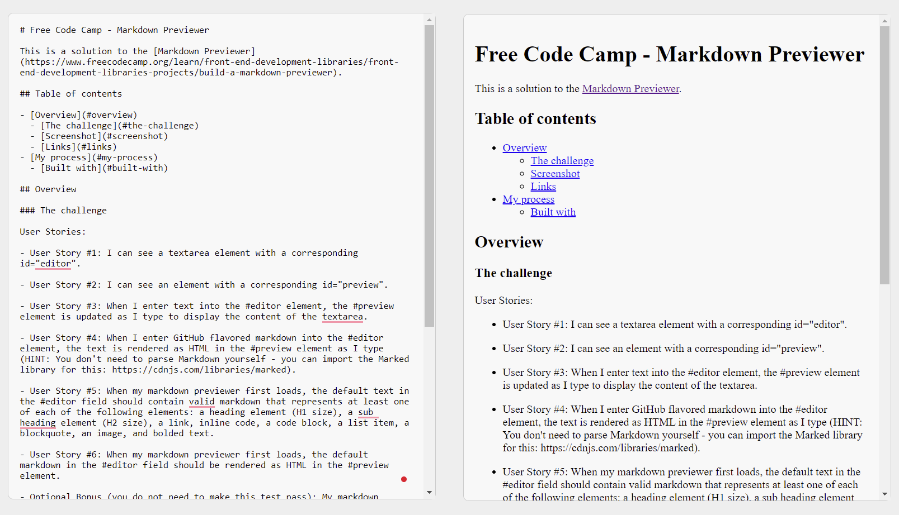

# Free Code Camp - Markdown Previewer

This is a solution to the [Markdown Previewer](https://www.freecodecamp.org/learn/front-end-development-libraries/front-end-development-libraries-projects/build-a-markdown-previewer).

## Table of contents

- [Overview](#overview)
  - [The challenge](#the-challenge)
  - [Screenshot](#screenshot)
  - [Links](#links)
- [My process](#my-process)
  - [Built with](#built-with)

## Overview

### The challenge

User Stories:

- User Story #1: I can see a textarea element with a corresponding id="editor".

- User Story #2: I can see an element with a corresponding id="preview".

- User Story #3: When I enter text into the #editor element, the #preview element is updated as I type to display the content of the textarea.

- User Story #4: When I enter GitHub flavored markdown into the #editor element, the text is rendered as HTML in the #preview element as I type (HINT: You don't need to parse Markdown yourself - you can import the Marked library for this: https://cdnjs.com/libraries/marked).

- User Story #5: When my markdown previewer first loads, the default text in the #editor field should contain valid markdown that represents at least one of each of the following elements: a heading element (H1 size), a sub heading element (H2 size), a link, inline code, a code block, a list item, a blockquote, an image, and bolded text.

- User Story #6: When my markdown previewer first loads, the default markdown in the #editor field should be rendered as HTML in the #preview element.

- Optional Bonus (you do not need to make this test pass): My markdown previewer interprets carriage returns and renders them as br (line break) elements.

### Screenshots

### Links

- Solution URL: [Code](https://github.com/yhertekin/FCC/tree/main/Frontend%20Development%20Libraries/MarkdownPreviewer)
- Live Site URL: [Live](https://cheerful-fairy-2a0a85.netlify.app/)

## My process

### Built with

- React
- TypeScript
- Vite
- CSS
