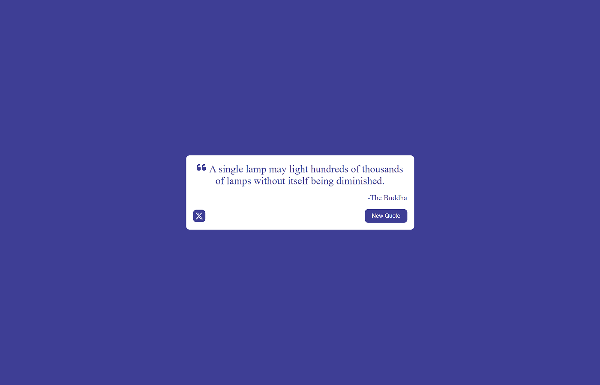
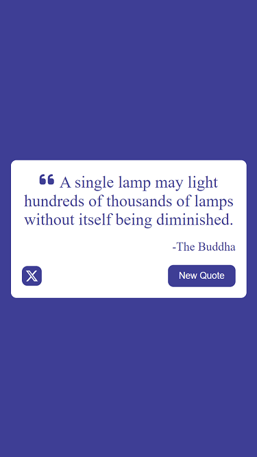

# Free Code Camp - Random Quote Machine

This is a solution to the [Random Quote Machine](https://www.freecodecamp.org/learn/front-end-development-libraries/front-end-development-libraries-projects/build-a-random-quote-machine).

## Table of contents

- [Overview](#overview)
  - [The challenge](#the-challenge)
  - [Screenshot](#screenshot)
  - [Links](#links)
- [My process](#my-process)
  - [Built with](#built-with)
- [React - TypeScript - Vite](#react-typescript-vite)

## Overview

### The challenge

User Stories:

- I can see a wrapper element with a corresponding id="quote-box".

- Within #quote-box, I can see an element with a corresponding id="text".

- Within #quote-box, I can see an element with a corresponding id="author".

- Within #quote-box, I can see a clickable element with a corresponding id="new-quote".

- Within #quote-box, I can see a clickable a element with a corresponding id="tweet-quote".

- On first load, my quote machine displays a random quote in the element with id="text".

- On first load, my quote machine displays the random quote's author in the element with id="author".

- When the #new-quote button is clicked, my quote machine should fetch a new quote and display it in the #text element.

- My quote machine should fetch the new quote's author when the #new-quote button is clicked and display it in the #author element.

- I can tweet the current quote by clicking on the #tweet-quote a element. This a element should include the "twitter.com/intent/tweet" path in its href attribute to tweet the current quote.

- The #quote-box wrapper element should be horizontally centered. Please run tests with browser's zoom level at 100% and page maximized.

### Screenshots

### Links

- Solution URL: [Code](https://github.com/yhertekin/FCC/tree/main/Frontend%20Development%20Libraries/RandomQuoteMachine)
- Live Site URL: [Live](https://main--brilliant-khapse-c39e81.netlify.app/)

## My process

### Built with

- React
- TypeScript
- Vite
- CSS

### React, TypeScript, Vite

This template provides a minimal setup to get React working in Vite with HMR and some ESLint rules.

Currently, two official plugins are available:

- [@vitejs/plugin-react](https://github.com/vitejs/vite-plugin-react/blob/main/packages/plugin-react/README.md) uses [Babel](https://babeljs.io/) for Fast Refresh
- [@vitejs/plugin-react-swc](https://github.com/vitejs/vite-plugin-react-swc) uses [SWC](https://swc.rs/) for Fast Refresh
