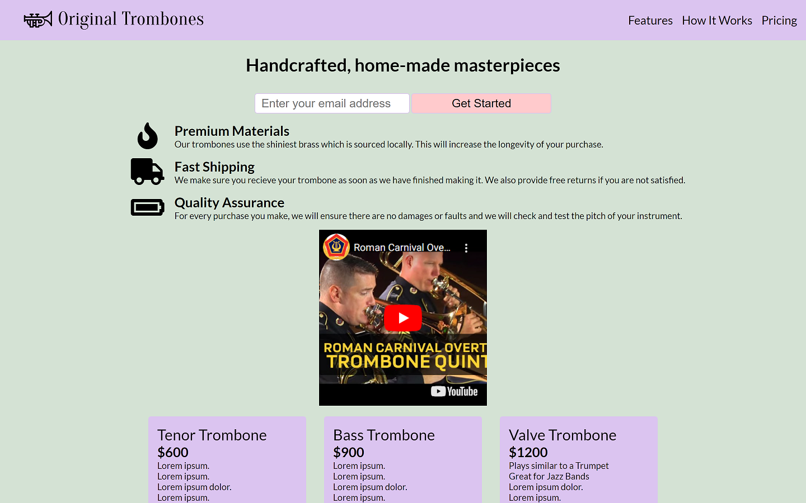
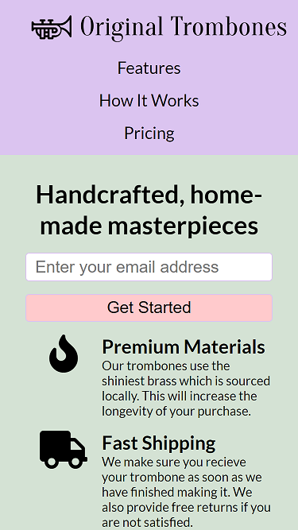

# Free Code Camp - Product Landing Page solution

This is a solution to the [Build a Product Landing Page](https://www.freecodecamp.org/learn/2022/responsive-web-design/build-a-product-landing-page-project/build-a-product-landing-page).

## Table of contents

- [Overview](#overview)
  - [The challenge](#the-challenge)
  - [Screenshot](#screenshot)
  - [Links](#links)
- [My process](#my-process)
  - [Built with](#built-with)

## Overview

### The challenge

User Stories:

- Your product landing page should have a header element with a corresponding id="header"
- You can see an image within the header element with a corresponding id="header-img" (A logo would make a good image here)
- Within the #header element, you can see a nav element with a corresponding id="nav-bar"
- You can see at least three clickable elements inside the nav element, each with the class nav-link
- When you click a .nav-link button in the nav element, you are taken to the corresponding section of the landing page
- You can watch an embedded product video with id="video"
- Your landing page has a form element with a corresponding id="form"
- Within the form, there is an input field with id="email" where you can enter an email address
- The #email input field should have placeholder text to let users know what the field is for
- The #email input field uses HTML5 validation to confirm that the entered text is an email address
- Within the form, there is a submit input with a corresponding id="submit"
- When you click the #submit element, the email is submitted to a static page (use this mock URL: https://www.freecodecamp.com/email-submit)
- The navbar should always be at the top of the viewport
- Your product landing page should have at least one media query
- Your product landing page should utilize CSS flexbox at least once

### Screenshots

### Links

- Solution URL: [Code](https://github.com/yhertekin/FCC/tree/main/Responsive%20Web%20Design/Product%20Landing%20Page)
- Live Site URL: [Live](https://jolly-basbousa-ccca2c.netlify.app/)

## My process

### Built with

- Semantic HTML5 markup
- CSS custom properties
- Flexbox
- Grid
