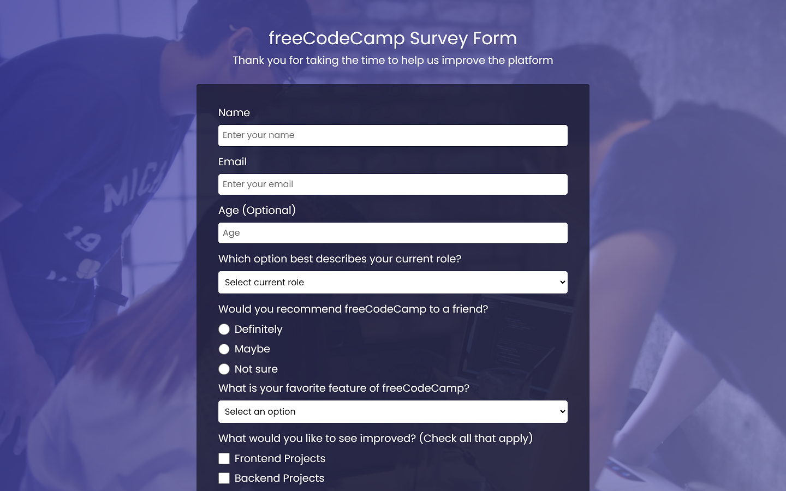
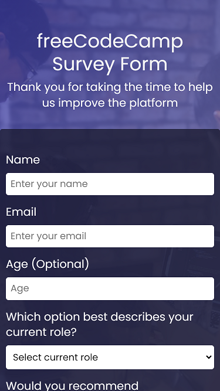

# Free Code Camp - Survey Form solution

This is a solution to the [Build a Survey Form](https://www.freecodecamp.org/learn/2022/responsive-web-design/build-a-survey-form-project/build-a-survey-form).

## Table of contents

- [Overview](#overview)
  - [The challenge](#the-challenge)
  - [Screenshot](#screenshot)
  - [Links](#links)
- [My process](#my-process)
  - [Built with](#built-with)

## Overview

### The challenge

User Stories:

- You should have a page title in an h1 element with an id of title
- You should have a short explanation in a p element with an id of description
- You should have a form element with an id of survey-form
- Inside the form element, you are required to enter your name in an input field that has an id of name and a type of text
- Inside the form element, you are required to enter your email in an input field that has an id of email
- If you enter an email that is not formatted correctly, you will see an HTML5 validation error
- Inside the form, you can enter a number in an input field that has an id of number
- The number input should not accept non-numbers, either by preventing you from typing them or by showing an HTML5 validation error (depending on your browser).
- If you enter numbers outside the range of the number input, which are defined by the min and max attributes, you will see an HTML5 validation error
- For the name, email, and number input fields, you can see corresponding label elements in the form, that describe the purpose of each field with the following ids: id="name-label", id="email-label", and id="number-label"
- For the name, email, and number input fields, you can see placeholder text that gives a description or instructions for each field
- Inside the form element, you should have a select dropdown element with an id of dropdown and at least two options to choose from
- Inside the form element, you can select an option from a group of at least two radio buttons that are grouped using the name attribute
- Inside the form element, you can select several fields from a series of checkboxes, each of which must have a value attribute
- Inside the form element, you are presented with a textarea for additional comments
- Inside the form element, you are presented with a button with id of submit to submit all the inputs

### Screenshots

### Links

- Solution URL: [Code](https://github.com/yhertekin/FCC/tree/main/Responsive%20Web%20Design/Survey%20Form)
- Live Site URL: [Live](https://endearing-crepe-ddd9ab.netlify.app/)

## My process

### Built with

- Semantic HTML5 markup
- CSS custom properties
- Flexbox
- Mobile-first workflow
