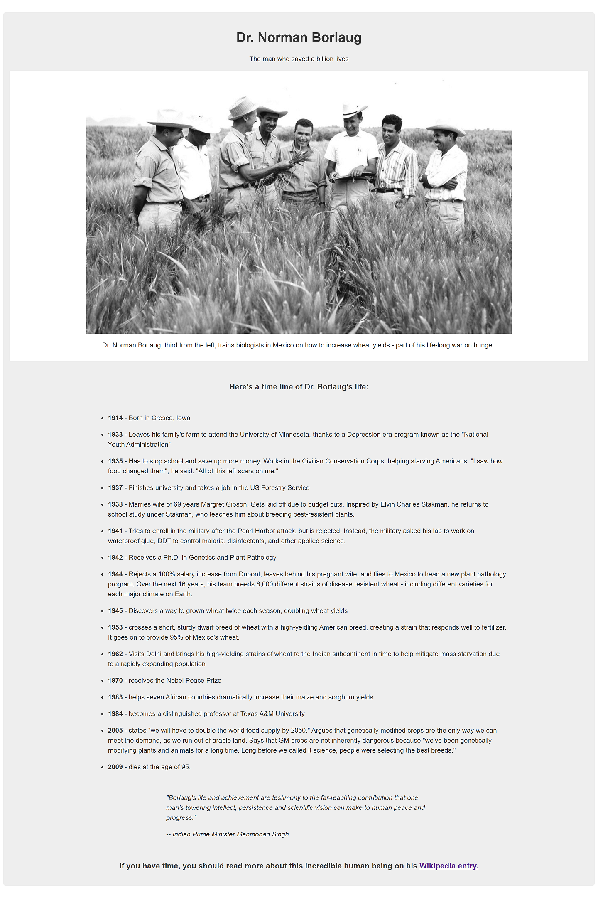
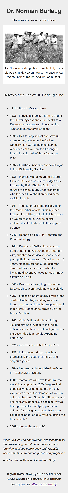

# Free Code Camp - Tribute Page

This is a solution to the [Build a Tribute Page](https://www.freecodecamp.org/learn/2022/responsive-web-design/build-a-tribute-page-project/build-a-tribute-page).

## Table of contents

- [Overview](#overview)
  - [The challenge](#the-challenge)
  - [Screenshot](#screenshot)
  - [Links](#links)
- [My process](#my-process)
  - [Built with](#built-with)

## Overview

### The challenge

User Stories:

- Your tribute page should have a main element with a corresponding id of main, which contains all other elements
- You should see an element with an id of title, which contains a string (i.e. text), that describes the subject of the tribute page (e.g. "Dr. Norman Borlaug")
- You should see either a figure or a div element with an id of img-div
- Within the #img-div element, you should see an img element with a corresponding id="image"
- Within the #img-div element, you should see an element with a corresponding id="img-caption" that contains textual content describing the image shown in #img-div
- You should see an element with a corresponding id="tribute-info", which contains textual content describing the subject of the tribute page
- You should see an a element with a corresponding id="tribute-link", which links to an outside site, that contains additional information about the subject of the tribute page.
- Your #image should use max-width and height properties to resize responsively, relative to the width of its parent element, without exceeding its original size
- Your img element should be centered within its parent element

### Screenshots

### Links

- Solution URL: [Code](https://github.com/yhertekin/FCC/tree/main/Responsive%20Web%20Design/Tribute%20Page)
- Live Site URL: [Live](https://calm-panda-46d0c8.netlify.app/)

## My process

### Built with

- Semantic HTML5 markup
- CSS custom properties
